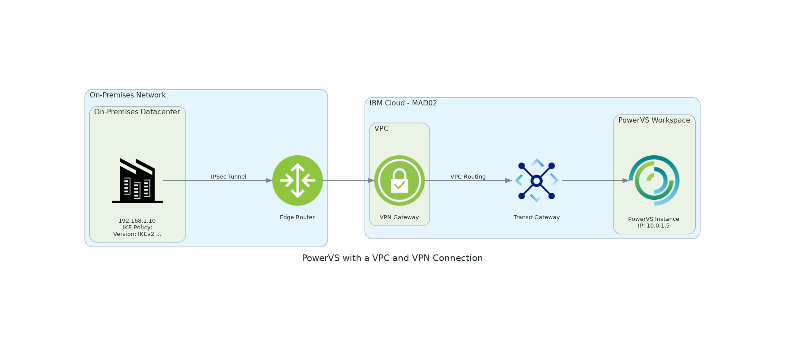

# PowerVS Diagram

This project generates a network architecture diagram showing an IBM PowerVS - IBM Cloud instance connected to an on-premises datacenter through a VPN and VPC using the diagrams Python package.

Setup

1. Build Docker Image

`docker build -t diagram-generator .`

2. Run Container with Volume

`docker run --rm -v $(pwd):/app -it diagram-generator`

3. Generate the Diagram

Inside the container, run:

`python diagram.py`

The diagram will be saved as a PNG in your local directory.

Files

	•	diagram.py: Generates the diagram.
	•	Dockerfile: Sets up the environment.
	•	requirements.txt: Lists dependencies.

That’s it!